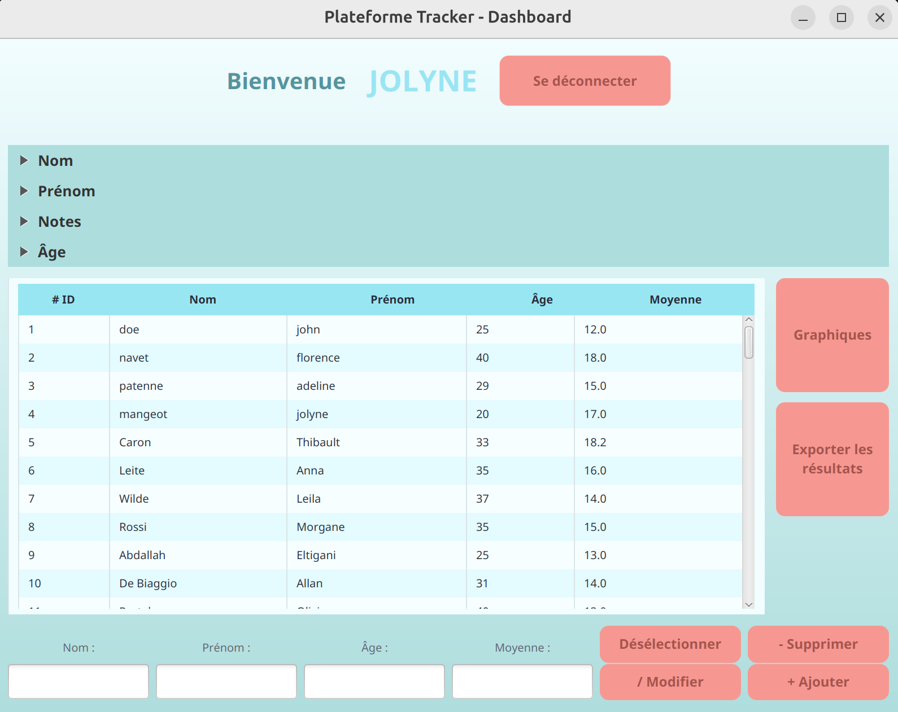

# 📚 La Plateforme Tracker

La Plateforme Tracker is a Java-based school project designed to manage and visualize student data stored in a PostgreSQL database. The application offers full CRUD functionality, filterable views, and graphical data representation using JavaFX.

## 🛠 Features
### - 🎓 **Student Management (CRUD)**
  - Add, update, delete, and list students, each with:
  - Last name
  - First name
  - Age
  - Average grade
### - 🔍 **Filtering System**
  - Filter students by:
  - Grade range
  - Age range
  - Name / First name (partial match)
### - 📊 **Graphical Visualization**
  - Display filtered student data using dynamic bar charts.
### - 👤 **User Authentication**
  - Account creation and login
  - Secure password storage (hashed with a unique salt per user)
___
## 🧩 Project Structure
```
src
├── main
│   ├── java
│   │   ├── DAO              # Database access (students, users)
│   │   ├── exceptions       # Custom exceptions
│   │   ├── ihmcontroller    # JavaFX controllers
│   │   ├── main             # Application launcher
│   │   ├── model            # Data models (Student, User)
│   │   ├── searchfilter     # Filtering logic
│   │   └── utils            # Utilities (e.g., DB connection, hashing)
│   └── resources
│       ├── icons            # App icons
│       ├── style            # CSS stylesheets
│       ├── GraphPage.fxml
│       ├── LoginPage.fxml
│       ├── MainPage.fxml
│       └── RegisterPage.fxml
├── test                     # Unit tests
├── .env                     # Database credentials
├── pom.xml                  # Maven configuration
└── creation_db.sql          # SQL script to create the database and tables
```
___
## 🚀 Getting Started
### ✅ Prerequisites
- Java JDK 17+
- Maven
- PostgreSQL
### 🧪 Installation Steps
#### 1. Clone the repository:
```bash
git clone https://github.com/AdelinePat/LaPlateformeTracker
cd LaPlateformeTracker
```
#### 2. Create the database:
- Open PostgreSQL (via pgAdmin or terminal)
- Run the creation_db.sql script located at the root of the project
#### 3. Configure the .env file:
Create a .env file in the root directory with the following variables:
```
URL=jdbc:postgresql://localhost:5432/your_database_name
USER=your_postgres_username
PASSWORD=your_postgres_password
DASHBOARD_PATH=/MainPage.fxml
REGISTER_PATH=/RegisterPage.fxml
LOGIN_PATH=/LoginPage.fxml
GRADEGRAPH_PATH=/GraphPage.fxml
```

#### 4. Build the project with Maven:
```
mvn clean install
```
#### 5. Run the application:
You can launch it directly from your IDE or with:
```
mvn javafx:run
```
## 🧪 Testing
The src/test folder includes unit tests for core functionalities. Run them with:
```
mvn test
```
## 📦 Dependencies
- JavaFX
- PostgreSQL JDBC driver
- Maven
- JUnit (for testing)
## 🔐 Security Notes
Passwords are hashed with a per-user unique salt
Stored securely in the database to protect user credentials
____
# 👥 Authors
Project developed by students at [La Plateforme School] as part of a group coursework.
- [Jolyne Mangeot](https://github.com/jolyne-mangeot)
- [Adeline Patenne](https://github.com/AdelinePat) 